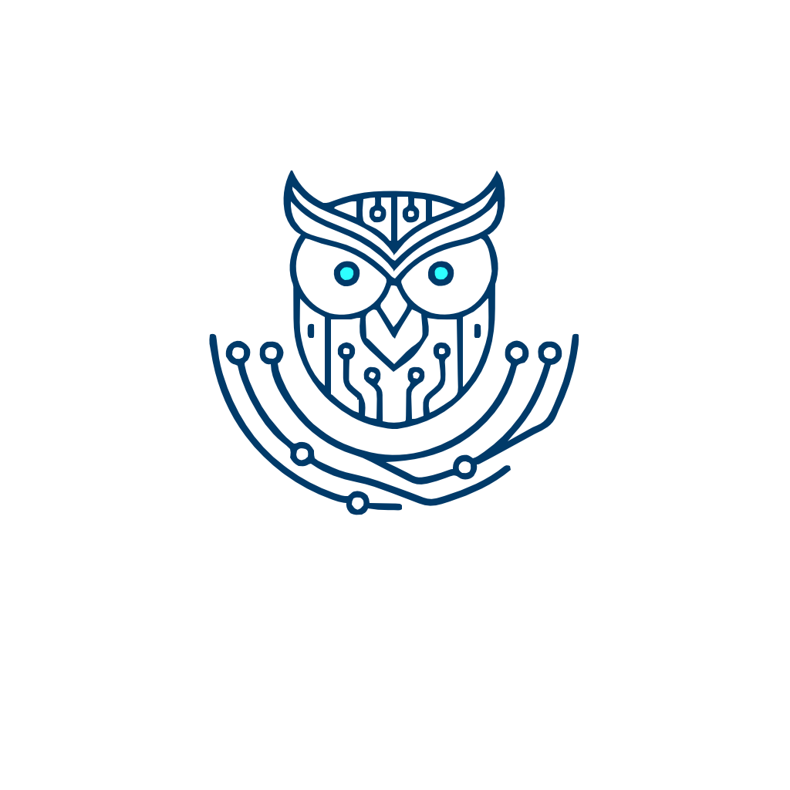

# Owl Nest - Frontend

<p align="center">
  
</p>

A personal digital sanctuary and creative laboratory where useful web utilities, interactive "useless" experiments, and a diverse engineering portfolio converge. From 3D visualizations to hardware projects, this is the central hub for my technical journey and custom-built tools.


## Goal and features

### Project Goal
Owl Nest is my personal digital headquarters, a "living" laboratory where I consolidate my technical world. This isn't just a landing page; it's a modular ecosystem designed for:
-   **Infrastructure Management**: A centralized hub to access and monitor my self-hosted private services.
-   **The "Useless" Lab**: A creative playground for purely visual or interactive experiments. It’s a space to explore frontend libraries and creative coding just for the sake of it.
-   **Public Toolbox**: Providing small, efficient web utilities (text cleaners, secure password sharing, 3D audio visualizers) for myself and the community.
-   **Engineering Log**: A transparent portfolio showcasing my journey through software development, hardware hacking, and robotics.

### Current Features
The project is currently in its early "nesting" phase. The experiment list is just starting to grow:
-   **Internationalization (i18n)**: Fully bilingual interface (English/French) built with `react-i18next`.
-   **Hexadecimal Time Tracker**: A visual widget tracking the year/month/day's progress through a hexadecimal lens.
-   **Fleeing Button Game**: A classic interactive "catch me if you can" component to test mouse interactions and basic physics.
-   **Decision Wheel**: A customizable spinning wheel for random choices.
-   **Audio Visualizer**: A 3D MP3 visualizer to bring music to life in the browser.

## Tech Stack
The Owl Nest frontend is built with a modern, performant, and type-safe stack. Every dependency is chosen to balance developer productivity with a high-quality end-user experience.
-   **[React 19](https://react.dev/)**: The core library for building the user interface, leveraging the latest features for improved performance and a streamlined development workflow.
-   **[Vite](https://vite.dev/)**: Used as the build tool and development server for its blazing-fast HMR (Hot Module Replacement) and optimized production builds.
-   **[TypeScript](https://www.typescriptlang.org/)**: Ensures code reliability and maintainability across the entire project through strict static typing.
-   **[Material UI (MUI) v7](https://mui.com/material-ui/)**: Provides the  foundation for the design system. It is heavily customized via a central theme to achieve a professional and structured aesthetic.
-   **[Zustand](https://zustand-demo.pmnd.rs/)**: A small, fast, and scalable barebones state-management solution used for global application state without the boilerplate of Redux.
-   **[TanStack Query v5](https://tanstack.com/query/latest)**: Manages asynchronous data fetching, caching, and synchronization, ensuring a smooth experience when interacting with service APIs.
    
-   **[React Router v7](https://reactrouter.com/)**: Handles internal navigation and deep linking within the modular architecture of the project.
-   **[React Hook Form](https://react-hook-form.com/)** & **[Zod](https://zod.dev/)**: Paired together for robust, type-safe form management and schema validation.
-   **[Lucide React](https://lucide.dev/)**: A library of beautiful, consistent icons used throughout the dashboard and experiments.
-   **[i18next](https://www.i18next.com/)**: Powers the internationalization framework, allowing the project to be fully bilingual (FR/EN) from the ground up.
  
## Project Structure

The project follows a modular and strictly typed architecture to ensure scalability and maintainability.
```text
src/
├── components/          # Reusable UI components
│   └── common/          # Atomic components (Buttons, Cards, Sidebar)
├── constants/           # Static data and configuration constants
├── i18n/                # Internationalization config and translation files
├── layouts/             # Page templates
├── pages/               # Page components and sub-modules
├── services/            # Business logic and data fetching
├── theme/               # Centralized MUI theme and design tokens
├── types/               # TypeScript interfaces and type definitions
├── utils/               # Helper functions and technical utilities
├── App.tsx              # Main application entry point
├── routes.tsx           # Centralized routing configuration
└── main.tsx             # React DOM rendering and providers setup
```

### Key Directories

-   **`src/components/common`**: This is the heart of the Design System. Every generic element lives here to ensure visual consistency.
-   **`src/pages`**: Each major section of the site has its own directory or file. For complex services, we use a sub-directory containing the index and specific sub-pages.
-   **`src/layouts`**: We decouple the navigation and global structure from the page content. This allows us to have different layouts (e.g., a standard one for services and a specific one for "useless" experiments).
-   **`src/services`**: Logic for retrieving data (currently from constants, later from APIs) is isolated here to keep components focused on the UI.
-   **`src/theme`**: A single source of truth for colors, shadows, and typography. No hardcoded CSS values should exist outside this folder.

## Getting Started

Follow these steps to get your development environment up and running.

### Prerequisites
-   **Node.js**: Version 20.x or higher is recommended.
-   **npm**: Version 10.x or higher.

### Installation
1.  **Clone the repository**:
    ```bash
    git clone https://github.com/nadi3/owl-nest.git
    cd owl-nest
    ```
2.  **Install dependencies**:
    ```bash
    npm install
    ```

### Development

To launch the local development server with Hot Module Replacement (HMR):
```bash
npm run dev
```

Once started, the application is typically accessible at `http://localhost:5173`.

**Maintenance Commands:**
-   `npm run build`: Compile and optimize the project for production.
-   `npm run lint`: Run the linter to check for code quality issues.
-   `npm run format`: Automatically fix code formatting using Prettier.

## Contributing & Standards
To maintain the high quality and modularity of the Owl Nest, all contributions must adhere to the following standards.

### Branching & Commits

We follow a structured approach to version control:
-   **Branch Naming**: Use descriptive prefixes:
    -   `feat/feature-name` for new features or experiments.
    -   `fix/bug-name` for bug fixes.
    -   `docs/changes` for documentation updates.
    -   `refactor/change-name` for code improvements without functional changes.
-   **Conventional Commits**: Commit messages must be clear and prefixed following the [conventional commits conventions](https://www.conventionalcommits.org/en/v1.0.0/). This keeps the history readable and allows for automated changelogs.

### Development Rules

-   **Naming Conventions**:
    -   **Components**: Use `PascalCase` for files and component names (e.g., `NestButton.tsx`).
    -   **Hooks/Utilities/Services**: Use `camelCase` (e.g., `uselessService.ts`).
-   **No Hardcoded Values**: Always use the design tokens from `src/theme/theme.ts` via the `sx` prop or `styled` components. Avoid hardcoding colors, spacing, or font sizes.
-   **Internationalization (i18n)**: Never hardcode user-facing strings in components. Add keys to `src/i18n/locales/en.json` and `fr.json` and use the `useTranslation` hook.

### Automated quality assurance (CI/CD)
The project uses GitHub Actions to enforce standards:
- **CI**: Every push triggers linting, type-checking, and a Docker build test.
- **Deployment**: To deploy a change to the production Raspberry Pi, add the `deploy` label to a Pull Request.

### Recommended Practices

-   **Type Safety**: Avoid using `any`. Define interfaces in `src/types/` for all data structures and service responses.
-   **Documentation**: Use brief JSDoc comments (in English) for complex logic or specific component props to explain the "why" behind the implementation.
-   **Imports Organization**: Keep imports tidy by grouping them:
    1.  React and third-party libraries.
    2.  Internal components and layouts.
    3.  Types, services, and constants.
    4.  Styles and theme.

## Deployment

The Owl Nest frontend is designed to be containerized and served via Nginx. The repository includes a `dockerfile` and a `docker-compose.yml` configured for a professional production environment.

### Infrastructure Integration

By default, the deployment configuration is tailored for an automated infrastructure managed by **Traefik** as a reverse proxy.

-   **Network**: It expects an external Docker network named `web-proxy`.
-   **Labels**: Traefik labels are pre-configured to handle routing and TLS certificates.

For a complete overview of the infrastructure (including the Traefik setup and global orchestration), please refer to the [owl-infra](https://www.google.com/search?q=https://github.com/nadi3/owl-infra) repository.

### Standalone Docker Deployment
If you wish to run the container without a global reverse proxy or the `web-proxy` network, you must adapt the `docker-compose.yml`:
1.  **Remove the external network**: Change the `networks` section to use a local driver instead of `external: true`.
2.  **Expose ports**: Add a `ports` mapping to access Nginx directly (e.g., `- "8080:80"`).
3.  **Remove Traefik labels**: The labels are ignored if Traefik is not present, but can be cleaned up for clarity.
    

### Build Process
The `dockerfile` uses a multi-stage build:
1.  **Build Stage**: Uses Node 20 to compile the React application and generate the `dist/` folder.
2.  **Production Stage**: Uses a lightweight Nginx image to serve the static files using a custom `nginx.conf`.

## Roadmap

The development of Owl Nest is divided into several iterative phases. The goal is to evolve from a simple dashboard to a fully integrated personal ecosystem.

### Infrastructure & Automation
-   **CI/CD Pipeline**: Implement GitHub Actions for automated linting, formatting, and testing on every push.
-   **Automated Deployment**: Set up a robust deployment workflow to sync the production environment with the latest stable branch.

### The Lab
Expanding the collection of visual and interactive experiments:

-   **The Infinite Wait**: A progress bar that never ends, tracking and displaying the record time a user spent pushing on a button.
-   **The Reluctant Button**: A button that moves and begs the user to stop clicking on an empty page.
-   **Excuse Generator**: A specialized tool to generate professional developer excuses or classic procrastination reasons.
-   **Impatience Detector**: A hidden monitor that triggers a "Slow down!" message if it detects frantic clicking.
-   **Technical Easter Eggs**: Integration of a Konami Code and a developer-only horoscope hidden in the browser console.
-   **Physics Playground**: A "Gravity" toggle that makes the page elements collapse, requiring the user to "rebuild" the UI.
-  **Interactive Terminal**: A CLI-style interface for power users to navigate the website and trigger experiments through commands—keyboard-only, the way it was meant to be.

### Public Toolbox
Creating a suite of useful, privacy-focused web tools:

-   **Text Processing**: A comprehensive text cleaner with multiple formatting and filtering options.
-   **Secure Secrets**: A password sharing service and a customizable QR code generator.
-   **Client-Side Anonymizer**: A photo face-blurring tool with zero cloud storage, everything stays in your browser.
-   **Ephemeral Collaboration**: Shared checklists via unique URLs for temporary collaborative tasks (e.g., shopping lists, todo, etc.).

### Hardware & IoT Integration
Bridging the gap between code and the physical world:
-   **LED Simulator**: A digital point of light that will eventually control a physical LED in my home lab.
-   **Home Weather Dashboard**: A real-time display connected to an ESP32 with sensors measuring local humidity and temperature.


## License

This project is licensed under the MIT License. See the `LICENSE` file for more details.
